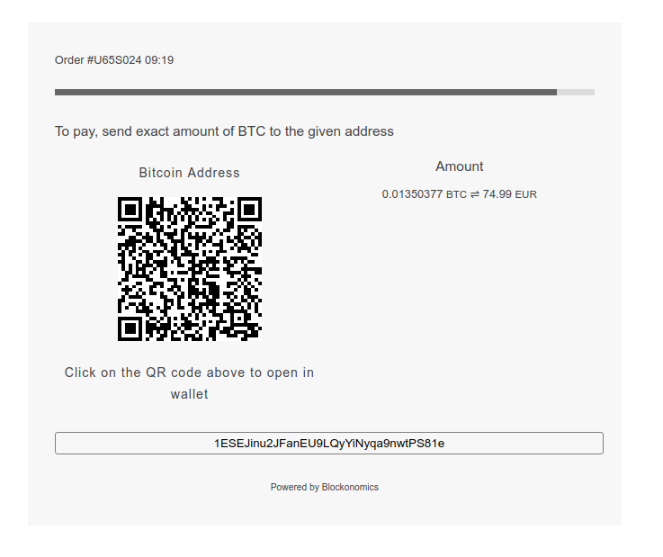
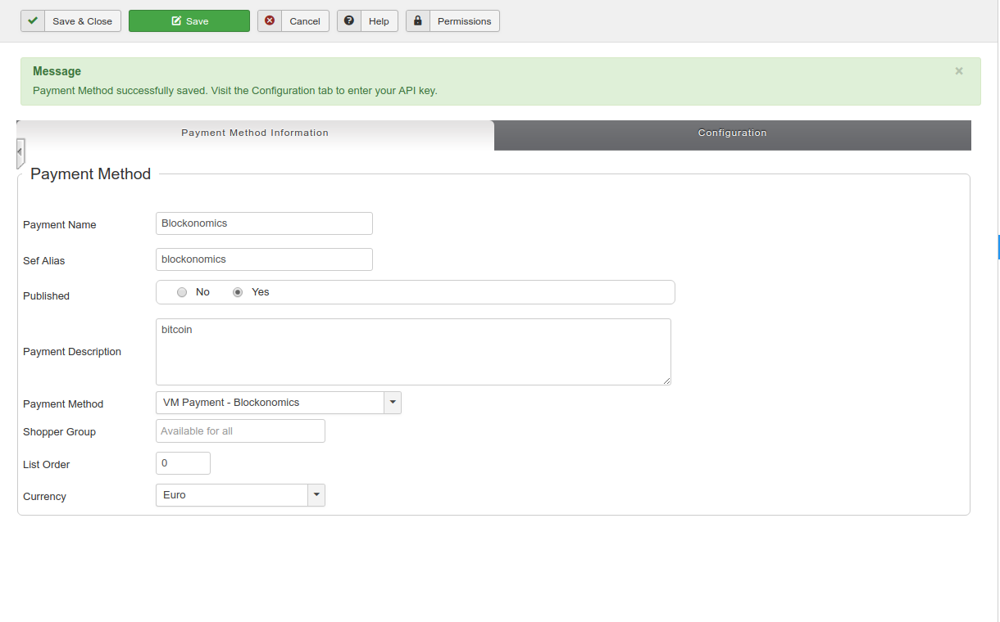
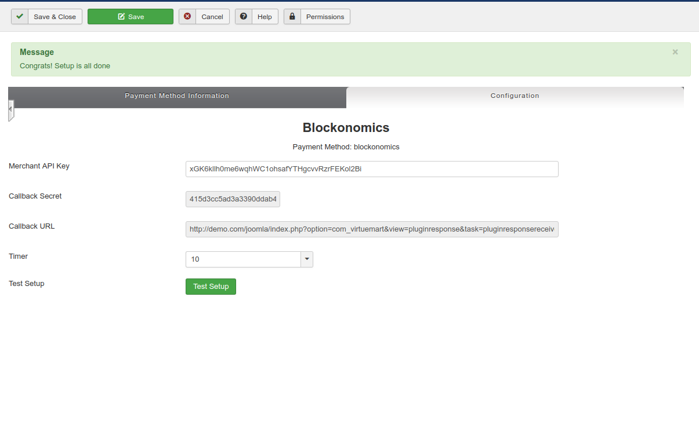

# Joomla Bitcoin Payments - Blockonomics #
Accept bitcoin payments on your Joomla website, Bitcoin payments go directly to your wallet.

## Description ##
- Accept bitcoin payments on your VirtueMart store with ease
- No security risk, payments go directly into your own bitcoin wallet

## Installation ##
- Get an API from [Blockonomics](https://www.blockonomics.co/merchants?utm_source=joomla)
- Download the latest release .zip
- Upload the zip file to Extensions -> Extension Manager -> Install
- Go to VirtueMart -> Payment Methods and click on "New" 
- Type in the payment method information, selecting "VM Payment - Blockonomics" as the Payment Method and "Yes" in the publish section.
- Save, then navigate to the configuration tab 
- Set you API key
- Click on the "Test Setup" button

You’re officially ready to accept bitcoins on your Joomla site.

## Screenshots ##

Payment screen

Payment Method settings
 

Blockonomics configuration 
 